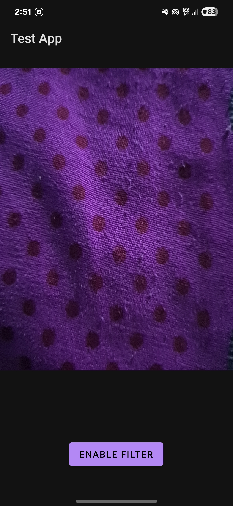
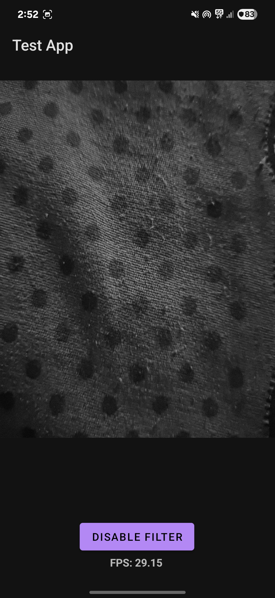

# Real-Time Edge Detection App (Android + OpenCV + OpenGL ES)

This app performs real-time edge detection using the Android camera (CameraX), processes frames with OpenCV via JNI (NDK), and renders the results using OpenGL ES for efficient GPU-based display.

---

## Features Implemented

-  Real-time camera preview using CameraX
-  Frame processing using OpenCV C++ (via JNI)
-  Display processed frames using OpenGL ES with texture rendering
-  Optimized for performance (RGBA conversion, grayscale toggle)
-  FPS counter displayed on screen
-  Multithreaded image analysis using `ImageAnalysis`
---

## Architecture Explanation
1. CameraX captures frames in RBGA_8888 format using the imageanalysis analyzer callback
2. Frame data in bytes array is passed to c++ code using jni(bridge between java and c++).
3. Frame processing(grayscale) is performed in c++
4. Opengl then uses the frames to create textures to render on the glSurfaceView whenever requestRender() is called.

---

## Screenshots / GIF

| Camera Feed | OpenGL Processed Output |
|-------------|-------------------------|
|  |  |

---

##  Setup Instructions

### Prerequisites

- Android Studio - newer versions are recommended
- Android NDK
- CMake and LLDB (installed via SDK Tools) - will be done automatically by gradle
- OpenCV Android SDK
  1. Download openCV from: [OpenCV](https://opencv.org/releases/)
  2. Extract the files and copy the sdk(found in the extracted files) folder to the root directory of the project
  3. Fire Up Android Studio then go to File > New > Import Module. Then browse to the sdk folder and give the module an appropriate name(opencv)
  4. Then Go to File > Project Structure > Dependencies > click + in declared dependecies section > add module dependencies > click on the module you imported just now

###  Installation

1. Clone the repository:
   ```bash
   git clone https://github.com/yourusername/EdgeDetectApp.git
